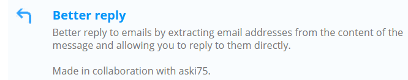
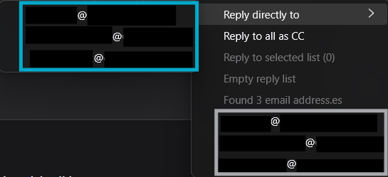
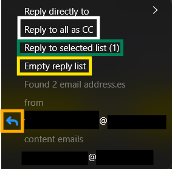
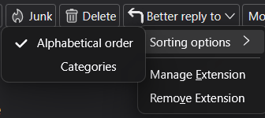
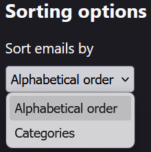

# Better Reply

[_French version here_](README_FR.md)

### This plugin use code of the GitHub project Email Finder by therealrobster (https://github.com/therealrobster/emailFinder)

The reused code includes creating the menu to list email addresses found in the current email.
This includes the sender and any email addresses found in the email body.

Source code from therealrobster is declared by `// Code from therealrobster =>` and `// <= End of code from therealrobster` .

## 1 - Overview

This plugin aims to add options when replying to emails.
For example, it can search for email addresses in the email body to reply directly to one of them.
Sometimes, the reply-to address is different from the sender address, but not specified in the "Reply-To" field.

The available features include:

- Find email addresses in the current email.
- Reply to a found email address.
- Select email addresses found in the current email.
- Reply to the selected list of email addresses.
- Clear the selected list of email addresses.
- Reply to all using CC (by default, Thunderbird replies to all using the "To" field).
- Sort found email addresses alphabetically or by category (From/To/CC/Body).
- Display a warning if replying to a BCC (blind carbon copy) email
  and the selected address is not the original sender.

## 2 - Installation

Search `Better Reply` from the official add-ons store and select this one : 
 

## 3 - Usage

To use the plugin, click on the `Reply to Some` menu
in the toolbar of the selected message in Thunderbird.  
This will open a menu with all email addresses found in the email,
including those in the `From`, `To`, `CC`, `Reply-To`, and email body fields. 
 
Several actions are available in this menu:

- `Reply to` : a dropdown menu that lets you directly reply to a specific email address _(outlined in blue above)_.   ⚠️ This menu is always sorted alphabetically!,
- `Reply All with CC` : replies by placing the recipients in the `To` field (sender) and `CC` field (remaining recipients), unlike Thunderbird’s default `Reply All` button which places all recipients in their original fields _(outlined in white below)_,
- `Reply to Selected List` : lets you reply to all email addresses after selecting them from the list _(outlined in green below)_,
- `Clear List` : clears the list of selected email addresses _(outlined in yellow below)_. 
   

Clicking on an email address in the menu allows you to select it for later reply.
A small blue arrow appears next to each selected email address,
indicating it's ready to be used for a reply. _(outlined in orange above)_

Right-clicking on the menu 
 
(or going into plugin settings: `Tools` > `Add-ons and Themes`,
then selecting `Add-on Options`, the wrench 🔧 icon for `Better Reply` in the installed extensions list)  
  
  
lets you access the sorting options for email addresses:

- `Alphabetical` : sorts email addresses from A to Z _(outlined in blue above)_.
- `By Category` : sorts email addresses by category
  (for example, addresses found in `From`, `To`, `CC`, `Reply-To`, and the email body
  are grouped accordingly). _(outlined in gray above)_

A safeguard is included to preserve anonymity if an email was received via BCC:
when replying to someone other than the sender of a BCC’d email,
a warning popup will appear asking if you want to cancel the reply or continue
(which would reveal that the person was originally in BCC).

These menus can be navigated using the keyboard arrow keys,
and actions can be triggered by pressing `Enter`.
