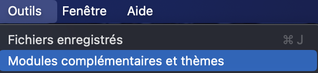
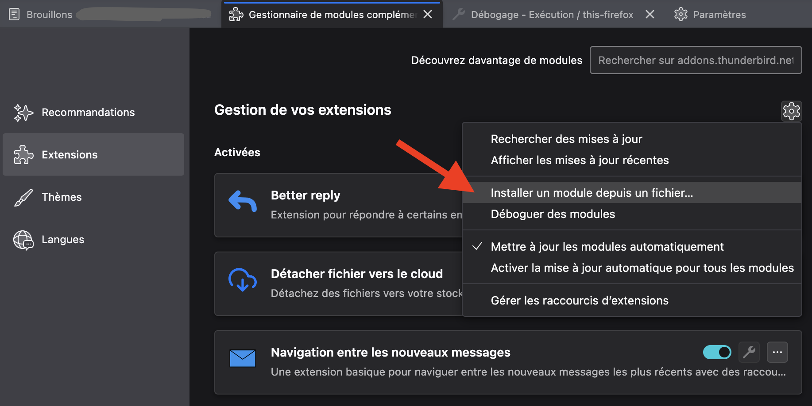
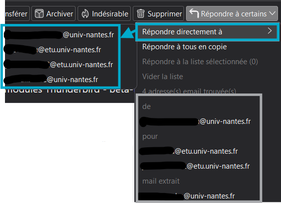
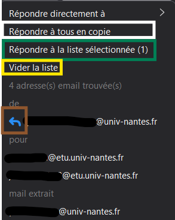
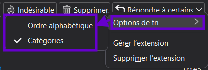
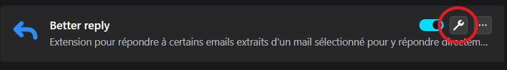
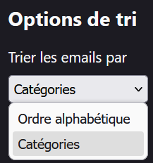

# Better Reply

### Ce plugin est un fork du projet github Email Finder ( https://github.com/therealrobster/emailFinder )

Le code réutilisé inclut la création du menu pour lister les adresses e-mail trouvées dans le mail actuel.
Celainclut l'expéditeur et les adresses e-mail dans le corps du mail.

Les modifications apportées sont répertoriées dans [Summary of modifications apply on base project.md](Summary%20of%20modifications%20apply%20on%20base%20project.md) ainsi que dans le code.

## 1 - Présentation

Ce plugin a pour but d'ajouter des options lors de la réponse aux mails.
Par exemple, chercher les adresses mails présentes dans le corp du mail pour effectuer la réponse à cette adresse.
Parfois, l'adresse de réponse n'est pas la même que l'adresse d'envoi, mais pas dans le champ "Répondre à".

Les fonctionnalités disponibles sont :

- Trouver les adresses e-mail dans le mail actuel.
- Répondre à une adresse e-mail trouvée.
- Sélectionner des adresses e-mail trouvées dans le mail actuel.
- Répondre à la liste d'adresses e-mail sélectionnées.
- Vider la liste d'adresses e-mail sélectionnées.
- Répondre à tous en cc (par défaut Thunderbird fait répondre à tous dans le champ "Pour").
- Trier les adresses e-mail trouvées par ordre alphabétique ou par catégorie dans le mail (De/Pour/CC/Corp).
- Afficher un avertissement si une réponse est faite à un mail reçu en CCI (copie cachée)
  et que l'adresse e-mail sélectionnée n'est pas l'expéditeur du mail.

## 2 - Installation

Le plugin en version beta-test n'étant pas validé par Mozilla, n'est pas encore sur le marché des extensions, il faut l'installer manuellement :  

1. Télécharger le fichier `Better_reply.xpi` depuis le dépôt GitHub du projet.  
2. Ouvrer Thunderbird.  
3. Aller dans le menu `Outils` > `Modules complémentaires et thèmes`.  
    
4. Cliquer sur l'icône d'engrenage en haut à droite, puis `Installer un module depuis un fichier...`.  
    
5. Sélectionner le fichier `Better_reply.xpi` téléchargé.  
6. Confirmer l'installation.  

## 3 - Utilisation

Pour utiliser le plugin, cliquer sur le menu `Répondre à certains`
dans la barre d'outils du message sélectionné dans Thunderbird.  
Cela ouvrira un menu avec toutes les adresses e-mail trouvées dans le mail,
y compris dans les champs `De`, `Pour`, `CC`, `Répondre à` et dans le corps du message. 
 
Il y a plusieurs actions disponibles dans ce menu :

- `Répondre à` : un menu déroulant qui permet de répondre directement à une adresse e-mail spécifique _(encadré en bleu ci-dessus)_.   ⚠️ Ce menu est toujours trié par ordre alphabétique !,
- `Répondre à tous en copie` : répond en répartissant les destinataires dans les champs `Pour` (l'expéditeur) et `CC` (le reste des destinataires initiaux), contrairement au bouton par défaut `Répondre à tous` qui met tous les destinataires dans leur champ initial _(encadré en blanc ci-dessous)_,
- `Répondre à la liste sélectionnée` : permet de répondre à toutes les adresses e-mail après les avoir sélectionnées dans la liste _(encadré en vert ci-dessous)_,
- `Vider la liste` : vide la liste des adresses e-mail sélectionnées _(encadré en jaune ci-dessous)_. 
   

Un clic sur une adresse e-mail dans le menu permet de la sélectionner pour une réponse ultérieure.
Une petite flèche bleue apparaît à côté de chaque adresse e-mail sélectionnée,
indiquant qu'elle est prête à être utilisée pour une réponse. _(encadré orange ci-dessus)_

Un clic droit sur le menu 
 
(ou dans les paramètres du plugin : menu `Outils` > `Modules complémentaires et thèmes`,
puis en sélectionnant `Options des modules`, la clé à molette 🔧 de `Better Reply` dans la liste des extensions installées)  
  
  
permet d'accéder à l'option de tri des adresses e-mail :

- `Alphabétique` : trie les adresses e-mail par ordre alphabétique (de A à Z) _(encadré en bleu ci-dessus)_.
- `Catégorie` : trie les adresses e-mail par catégorie
  (par exemple, les adresses e-mail trouvées dans les champs
  `De`, `Pour`, `CC`, `Répondre à` et dans le corps du message
  sont regroupées par catégorie). _(encadré en gris ci-dessus)_

Une sécurité est ajoutée pour préserver l'anonymat si un mail a été reçu en `copie cachée`CCi :
en répondant à une autre personne que l'expéditeur d'un mail reçu en copie cachée,
une fenêtre d'avertissement s'affiche pour confirmer si vous souhaitez annuler la réponse ou continuer
(ce qui informera le destinataire que la personne étant initialement en copie cachée).

Ces menus peuvent être navigués à l'aide des touches fléchées du clavier,
et les actions peuvent être déclenchées en appuyant sur `Entrée`.
